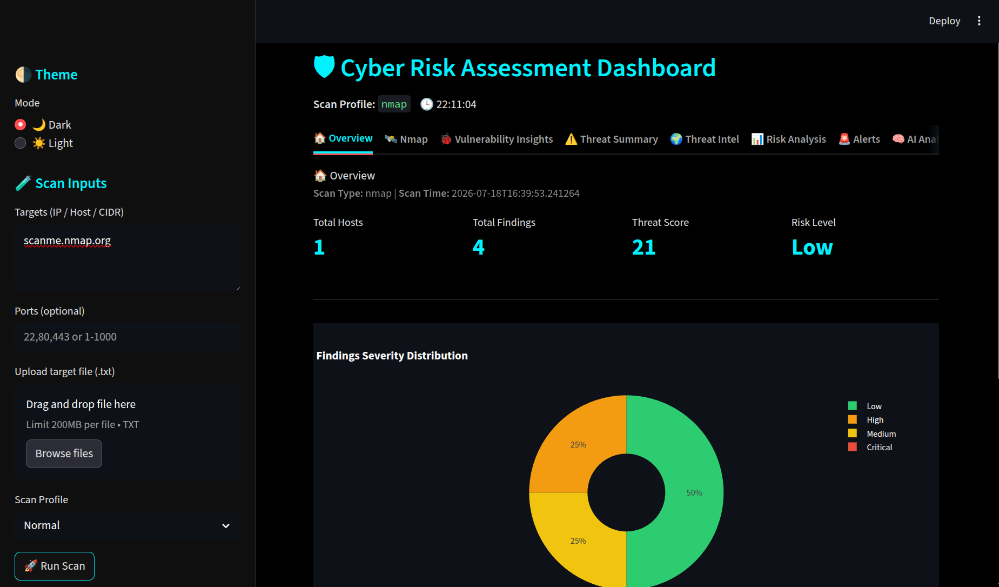
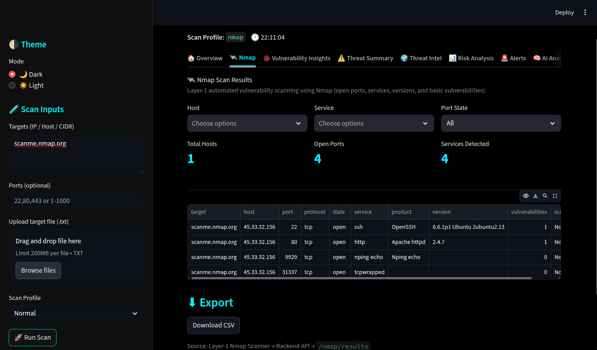
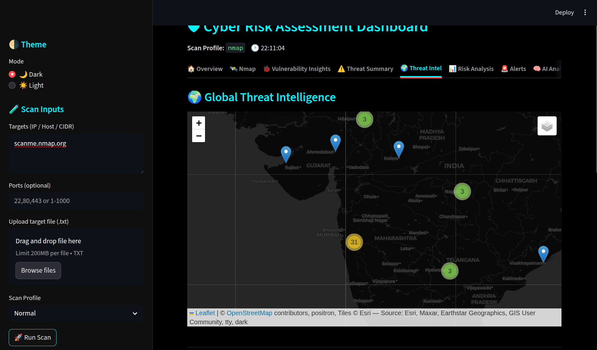
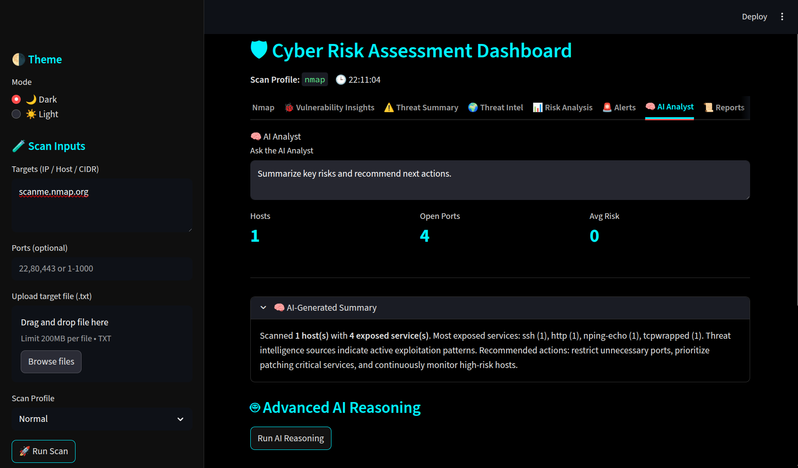

# 🛡️ Cyber Risk Assessment Platform (CRATIP)

> **Automated Vulnerability Scanning, Threat Intelligence, and Risk Assessment System**

[](https://www.python.org/)
[](https://fastapi.tiangolo.com/)
[](https://streamlit.io/)
[](LICENSE)

<br>

## 📋 Table of Contents

- [Overview](#-overview)
- [Features](#-features)
- [Repository Structure](#repository-structure)
- [Architecture](#️-architecture)
- [Technology Stack](#technology-stack)
- [Installation](#-installation)
- [Quick Start](#-quick-start-make-sure-that-your-virtual-environment-is-activated)
- [System Components](#-system-components)
- [Alert System](#-alert-system)
- [Data Flow](#-data-flow)
- [API Documentation](#-api-documentation)
- [Dashboard](#-dashboard)
- [Configuration](#configuration)
- [Project Requirements Compliance](#-project-requirements-compliance)

---

## 🎯 Overview

The Cyber Risk Assessment Platform (CRATIP) is an enterprise-grade security assessment system that combines automated vulnerability scanning, threat intelligence enrichment, and AI-powered risk analysis to provide comprehensive security insights.

### Key Capabilities

✅ **Automated Vulnerability Scanning** - Nmap-based network discovery and service detection  
✅ **Threat Intelligence Integration** - Real-time data from VirusTotal, Shodan, Vulners, and NVD  
✅ **Risk Scoring & Analysis** - ML-based scoring with critical/high/medium/low classification  
✅ **Automated Alerting** - Real-time notifications for high-risk vulnerabilities  
✅ **Centralized Dashboard** - Interactive Streamlit interface with charts and metrics  
✅ **Audit-Ready Reports** - PDF, Excel, and CSV export capabilities  
✅ **AI Analyst** - OpenAI-powered threat analysis and remediation recommendations

## Output (scan result of scanme.nmap.org)
<div align="center">
    Dashboard</img><br>
    Nmap discovery</img><br>
    Folium Maps</img><br>
    AI-Reasoning<br>
</div>

---
## Repository Structure
```
Directory structure:
└── nevinbeno-The-CRATIP/
    ├── README.md
    ├── requirements.txt
    ├── backend/
    │   ├── alerts.py
    │   ├── config.py
    │   ├── database.py
    │   ├── main.py
    │   ├── schemas.py
    │   ├── reports/
    │   │   ├── csv_report.py
    │   │   ├── excel_report.py
    │   │   └── pdf_report.py
    │   └── services/
    │       ├── layer1_service.py
    │       ├── layer2_service.py
    │       ├── layer3_service.py
    │       └── orchestrator.py
    ├── dashboard/
    │   ├── app.py
    │   ├── data_loader.py
    │   ├── _pages/
    │   │   ├── ai_analyst.py
    │   │   ├── alerts.py
    │   │   ├── nmap.py
    │   │   ├── overview.py
    │   │   ├── reports.py
    │   │   ├── risk_analysis.py
    │   │   ├── threat_intel.py
    │   │   ├── threat_summary.py
    │   │   └── vulnerability.py
    │   └── utils/
    │       └── pdf_export.py
    ├── layer1_scanning/
    │   ├── __init__.py
    │   ├── profiles.py
    │   ├── scanner.py
    │   └── utils.py
    ├── layer2_threat_intel/
    │   ├── __init__.py
    │   ├── enricher.py
    │   ├── utils.py
    │   └── clients/
    │       ├── nvd.py
    │       ├── shodan.py
    │       ├── virustotal.py
    │       └── vulners.py
    ├── layer3_risk_scoring/
    │   ├── ai_reasoner.py
    │   └── scorer.py
    └── .devcontainer/
        └── devcontainer.json
```
______
## 🚀 Features

### 1. Multi-Layer Security Architecture

#### **Layer 1: Network Scanning**
- Automated Nmap scans with customizable profiles (Quick, Normal, Intensive)
- Service detection and version identification
- Port state analysis
- CIDR/ASN filtering support

#### **Layer 2: Threat Intelligence**
- **VirusTotal**: IP reputation and malware detection
- **Shodan**: Public exposure and vulnerability assessment
- **Vulners**: CVE database integration
- **NVD**: National Vulnerability Database lookups

#### **Layer 3: Risk Scoring**
- Asset-level risk scoring (0-100 scale)
- Severity classification (Critical/High/Medium/Low)
- Service-based risk calculations
- Threat intel impact scoring

### 2. Automated Alert System

#### Alert Types
- 🔴 **Critical Risk Score** (≥80)
- 🟠 **High Risk Score** (≥60)
- 🟠 **Multiple Vulnerabilities** (≥5)
- 🟠 **High-Risk Ports Exposed** (SSH, RDP, SMB, SQL)
- 🔴 **Malicious IP Detected**
- 🟠 **Shodan Vulnerabilities** (>5)
- 🟡 **Unusual Port Activity** (>20 open ports)

#### Alert Features
- Real-time generation after each scan
- Configurable thresholds
- Dashboard integration with filtering
- Historical tracking and analytics
- CSV export capability

### 3. Interactive Dashboard

- **Overview**: Executive summary with KPIs
- **Nmap Results**: Detailed service inventory
- **Vulnerability Insights**: Severity-based analysis
- **Threat Summary**: Aggregated threat intelligence
- **Threat Intel**: Detailed external data sources
- **Risk Analysis**: Risk scoring and trends
- **Alerts**: Real-time security notifications
- **AI Analyst**: GPT-powered security insights
- **Reports**: Compliance-ready documentation

---

## 🏗️ Architecture

```
┌─────────────────────────────────────────────────────────────┐
│                     DASHBOARD (Streamlit)                   │
│  Overview | Nmap | Vulnerabilities | Threats | Alerts      │
└─────────────────────┬───────────────────────────────────────┘
                      │
                      ▼
┌─────────────────────────────────────────────────────────────┐
│                  BACKEND API (FastAPI)                      │
│  /scan/start | /nmap/results | /risk/summary | /alerts     │
└─────────────────────┬───────────────────────────────────────┘
                      │
        ┌─────────────┼─────────────┐
        ▼             ▼             ▼
   ┌────────┐   ┌────────┐   ┌────────┐
   │Layer 1 │   │Layer 2 │   │Layer 3 │
   │ Nmap   │──▶│Threat  │──▶│ Risk   │
   │Scanning│   │ Intel  │   │Scoring │
   └────────┘   └────────┘   └───┬────┘
                                  │
                                  ▼
                            ┌───────────┐
                            │  Alerts   │
                            │Generation │
                            └─────┬─────┘
                                  │
                                  ▼
                            ┌───────────┐
                            │ Database  │
                            │ (SQLite)  │
                            └───────────┘
```

## Technology Stack

**Backend:**
- FastAPI 0.115.0 - High-performance async API framework
- SQLite 3 - Embedded database for scan storage
- Pydantic 2.9.0 - Data validation

**Scanning & Security:**
- python-nmap 0.7.1 - Network scanning
- Shodan 1.31.0 - Internet-wide asset discovery
- Vulners 2.1.0 - Vulnerability intelligence

**Dashboard:**
- Streamlit 1.39.0 - Interactive web interface
- Plotly 5.24.1 - Data visualization
- Pandas 2.2.3 - Data manipulation

**Reporting:**
- ReportLab 4.2.5 - PDF generation
- XlsxWriter 3.2.0 - Excel reports
- OpenPyXL 3.1.5 - Excel manipulation

---

## 📦 Installation

### Prerequisites
- Python 3.10 or higher
- Nmap installed on system. ([Install nmap](./helper_docs/nmap_setup.md))
- API keys (optional but recommended):
  - [VirusTotal API key](./helper_docs/VirusTotal_API_setup.md)
  - [Shodan API key](./helper_docs/Shodan_API_setup.md)
  - [Vulners API key](./helper_docs/Vulners_API_setup.md)
  - [NVD API key](./helper_docs/NVD_API_key.md)
  - [OpenRouter API key (for AI features)](./helper_docs/OpenRouter_API_key.md)

### Step 1: Clone Repository
  ```bash
  git clone nevinbeno/The-CRATIP.git
  cd The-CRATIP
  ```

### Step 2: Create Virtual Environment
  ```bash
  python -m venv .venv
  ```
### Step 3: Activate Virtual Environment
  ```bash
  .venv\Scripts\activate # windows

  source .venv/bin/activate # linux / Mac
  ```
### Step 4: Install Dependencies
  ```bash
  pip install --upgrade pip   # (optional: upgrade pip)

  pip install -r requirements.txt
  ```

### Step 5: Configure Environment

Create a `.env` file in the project root:

  ```env
  # API Keys (Optional)
  VIRUSTOTAL_API_KEY=your_virustotal_key
  SHODAN_API_KEY=your_shodan_key
  VULNERS_API_KEY=your_vulners_key
  NVD_API_KEY=your_nvd_key
  OPENROUTER_API_KEY=your_openrouter_key

  # Database
  DATABASE_URL=sqlite:///backend/cratip.db

  # Backend
  BACKEND_HOST=127.0.0.1
  BACKEND_PORT=8000
  ```

---

## 🎬 Quick Start (make sure that your virtual environment is activated)

### Option 1: Using Separate Terminals

**Terminal 1 - Backend:**
```bash
uvicorn backend.main:app --reload --host 0.0.0.0 --port 8000
```

**Terminal 2 - Dashboard:**
```bash
streamlit run dashboard/app.py
```

### Option 2: Using PowerShell Script

```powershell
# Start Backend
Start-Process powershell -ArgumentList "-NoExit", "-Command", "cd backend; uvicorn main:app --reload"

# Start Dashboard
Start-Process powershell -ArgumentList "-NoExit", "-Command", "streamlit run dashboard/app.py"
```

### Access the Application

- **Dashboard**: http://localhost:8501
- **API Documentation**: http://localhost:8000/docs
- **Backend Health**: http://localhost:8000/health

---

## 🧩 System Components

### Backend Services

#### **Layer 1 Service** (`backend/services/layer1_service.py`)
```python
def run_layer1_scan(targets, ports, scan_profile):
    """
    Executes Nmap scan and returns flat service list
    
    Returns:
        {
            "services": [...],
            "total_services": N
        }
    """
```

#### **Layer 2 Service** (`backend/services/layer2_service.py`)
```python
def run_layer2_enrichment(layer1_result):
    """
    Enriches scan with threat intelligence
    
    Returns:
        {
            "data": {host: {services: [...]}},
            "threat_intel": {host: {vt, shodan, ...}}
        }
    """
```

#### **Layer 3 Service** (`backend/services/layer3_service.py`)
```python
def run_layer3_scoring(layer2_result):
    """
    Calculates risk scores and aggregates statistics
    
    Returns:
        {
            "assets": [{ip, risk_score, risk_level, ...}],
            "risk": {total_assets, critical, high, ...}
        }
    """
```

### Database Schema

#### **Scans Table**
```sql
CREATE TABLE scans (
    id INTEGER PRIMARY KEY,
    scan_type TEXT,
    scan_profile TEXT,
    targets TEXT,
    ports TEXT,
    layer1_json TEXT,
    layer2_json TEXT,
    layer3_json TEXT,
    created_at TEXT
);
```

#### **Alerts Table**
```sql
CREATE TABLE alerts (
    id INTEGER PRIMARY KEY,
    alert_type TEXT,
    severity TEXT,
    title TEXT,
    description TEXT,
    targets TEXT,
    created_at TEXT,
    acknowledged INTEGER DEFAULT 0
);
```

#### **Audit Logs Table**
```sql
CREATE TABLE audit_logs (
    id INTEGER PRIMARY KEY,
    timestamp TEXT,
    username TEXT,
    action TEXT,
    details TEXT
);
```

---

## 🚨 Alert System

### Configuration

Alert thresholds can be customized in `backend/alerts.py`:

```python
ALERT_THRESHOLDS = {
    "CRITICAL_RISK_SCORE": 80,
    "HIGH_RISK_SCORE": 60,
    "CRITICAL_VULNERABILITIES": 5,
    "HIGH_RISK_PORTS": {22, 3389, 445, 1433, 3306},
    "MALICIOUS_IP_THRESHOLD": 3,
}
```

### Alert Generation Flow

```
Scan Completed
    ↓
Layer 3 Results Available
    ↓
generate_alerts_from_scan()
    ↓
Check Each Alert Rule
    ↓
Create Alert in Database
    ↓
Display in Dashboard
```

### Dashboard Features

- **Alert Overview**: Total, Active, Critical, High, Acknowledged counts
- **Filtering**: By severity, status, and type
- **Visualization**: Severity distribution pie chart, timeline chart
- **Export**: CSV download for all alerts

---

## 🔄 Data Flow

### Complete Pipeline

```
1. User Initiates Scan (Dashboard)
        ↓
2. POST /scan/start (Backend API)
        ↓
3. Background Task Starts
        ↓
4. Layer 1: Nmap Scan
   Output: Flat list of services
        ↓
5. Layer 2: Threat Intelligence
   Output: Host-organized data + threat intel
        ↓
6. Layer 3: Risk Scoring
   Output: Assets + aggregated risk summary
        ↓
7. Alert Generation
   Checks thresholds, creates alerts
        ↓
8. Database Storage
   All layers saved as JSON
        ↓
9. Dashboard Auto-Refresh
   Loads data via API endpoints
        ↓
10. Display: Charts, Metrics, Tables, Alerts
```

### Data Structures

**Layer 1 Output:**
```json
{
  "services": [
    {
      "host": "192.168.1.1",
      "port": 80,
      "protocol": "tcp",
      "state": "open",
      "service": "http",
      "product": "Apache",
      "version": "2.4.41",
      "vulnerabilities": 2
    }
  ],
  "total_services": 10
}
```

**Layer 2 Output:**
```json
{
  "data": {
    "192.168.1.1": {
      "services": [...]
    }
  },
  "threat_intel": {
    "192.168.1.1": {
      "virustotal": {...},
      "shodan": {...},
      "vulners": [...],
      "nvd": [...]
    }
  }
}
```

**Layer 3 Output:**
```json
{
  "assets": [
    {
      "ip": "192.168.1.1",
      "risk_score": 75,
      "risk_level": "HIGH",
      "open_ports": 5,
      "vulnerabilities": 10
    }
  ],
  "risk": {
    "total_assets": 5,
    "critical": 1,
    "high": 2,
    "medium": 1,
    "low": 1,
    "overall_score": 65
  }
}
```

---

## 📡 API Documentation

### Scan Endpoints

#### **POST /scan/start**
Start a new vulnerability scan

**Request:**
```json
{
  "targets": ["192.168.1.1", "192.168.1.2"],
  "ports": "1-1000",
  "scan_profile": "Normal"
}
```

**Response:**
```json
{
  "status": "started",
  "targets": ["192.168.1.1", "192.168.1.2"],
  "scan_profile": "Normal"
}
```

#### **GET /scan/status**
Get current scan status

**Response:**
```json
{
  "state": "running",
  "started_at": "2026-01-12T10:30:00",
  "finished_at": null
}
```

### Data Endpoints

#### **GET /nmap/results**
Get flattened scan results

**Response:** Array of service objects

#### **GET /threat/intel**
Get threat intelligence data

**Response:** Array of IP-based threat intel

#### **GET /risk/summary**
Get aggregated risk summary

**Response:**
```json
{
  "total_assets": 5,
  "critical": 1,
  "high": 2,
  "medium": 1,
  "low": 1,
  "overall_score": 65
}
```

### Alert Endpoints

#### **GET /alerts**
Get all alerts

#### **GET /alerts/active**
Get unacknowledged alerts only

#### **GET /alerts/stats**
Get alert statistics

**Response:**
```json
{
  "total": 15,
  "active": 8,
  "critical": 3,
  "high": 5,
  "medium": 7,
  "acknowledged": 7
}
```

---

## 📊 Dashboard

### Pages Overview

1. **🏠 Overview** - Executive summary with key metrics
2. **🛰️ Nmap** - Detailed scan results table
3. **🐞 Vulnerability Insights** - Severity-based vulnerability analysis
4. **⚠️ Threat Summary** - Aggregated threat posture
5. **🌍 Threat Intel** - External intelligence sources
6. **📊 Risk Analysis** - Risk scoring and trends
7. **🚨 Alerts** - Security alert monitoring
8. **🧠 AI Analyst** - GPT-powered insights
9. **📜 Reports** - Export and compliance

### Key Features

- **Real-time Updates**: Auto-refresh during scans
- **Interactive Charts**: Plotly-based visualizations
- **Filtering**: Multi-criteria filtering on all pages
- **Export**: CSV, Excel, PDF report generation
- **Dark/Light Theme**: User-selectable interface mode

---

## ⚙️ Configuration

### Scan Profiles

- **Quick**: Fast scan of top 100 ports
- **Normal**: Standard scan with service detection
- **Intensive**: Comprehensive scan with OS detection

### API Rate Limits

Configure in `.env`:
```env
VIRUSTOTAL_RATE_LIMIT=4
SHODAN_RATE_LIMIT=1
```

### Alert Customization

Modify thresholds in `backend/alerts.py`:
```python
ALERT_THRESHOLDS = {
    "CRITICAL_RISK_SCORE": 80,
    "HIGH_RISK_SCORE": 60,
    # Add custom thresholds
}
```

---

## ✅ Project Requirements Compliance

### Required Outcomes

| Requirement | Status | Implementation |
|------------|--------|----------------|
| Automated vulnerability scanning and risk scoring | ✅ Complete | Layer 1 (Nmap) + Layer 3 (Risk Scoring) |
| Integration with third-party security APIs | ✅ Complete | VirusTotal, Shodan, Vulners, NVD |
| Centralized dashboards for monitoring | ✅ Complete | 9-page Streamlit dashboard |
| Alerts for high-risk vulnerabilities | ✅ Complete | Automated alert system with 7 types |
| Audit-ready reports | ✅ Complete | PDF, Excel, CSV exports |

### Additional Features

- AI-powered threat analysis
- Historical trend tracking
- Real-time metric updates
- Configurable alert thresholds
- Comprehensive audit logging

---

## 🔧 Troubleshooting

### Common Issues

**Backend not starting:**
```bash
# Check if port 8000 is available
netstat -ano | findstr :8000

# Kill existing process if needed
taskkill /PID <pid> /F
```

**Dashboard connection error:**
- Ensure backend is running on port 8000
- Check `API = "http://127.0.0.1:8000"` in dashboard/app.py

**Nmap not found:**
- Install Nmap from https://nmap.org/download.html
- Add to system PATH

**API keys not working:**
- Verify `.env` file is in project root
- Check key format (no quotes needed)
- Restart backend after adding keys

---

## 🤝 Contributing

Contributions are welcome! Please follow these guidelines:

1. Fork the repository
2. Create a feature branch
3. Commit your changes
4. Push to the branch
5. Create a Pull Request

---

## 📄 License

This project is licensed under the MIT License.

---

## 👥 Authors

- **Development Team** - Infosys Final Project

---

## 🙏 Acknowledgments
- Mr. Utkarsh Dixit, Mentor at Infosys
- Nmap Development Team
- FastAPI Framework
- Streamlit Community
- Security Intelligence Providers (VirusTotal, Shodan, Vulners, NVD)

---

## 📞 Support

For issues and questions:
- Create an issue in the repository
- Contact the development team

---
## Release
**Version:** 1.0.0  
**Status:** Production Ready ✅


🎉 Project Successfully Running!
🌐 Access URLs:
Dashboard (Streamlit):

Local: http://localhost:8502
Network: http://192.168.1.6:8502
Backend API (FastAPI):

API Documentation: http://localhost:8000/docs<br>
Health Check: http://localhost:8000/health<br>
🚀 How to Use:<br>
Open the Dashboard → http://localhost:8502<br>
Configure Scan → Use left sidebar<br>
Enter target IPs or domains (e.g., scanme.nmap.org)<br>
Select scan profile (Quick/Normal/Intensive)<br>
Optional: Specify ports<br>
Start Scan → Click the "Start Scan" button<br>
Monitor Results → Navigate through tabs:<br>
🏠 Overview - Executive summary<br>
🛰️ Nmap - Scan details<br>
🚨 Alerts - Security notifications<br>
📊 Risk Analysis - Risk scores<br>
🧠 AI Analyst - GPT insights<br>
✨ All Features Active:<br>
✅ Automated vulnerability scanning<br>
✅ Threat intelligence (VirusTotal, Shodan, Vulners, NVD)<br>
✅ Risk scoring and classification<br>
✅ Real-time security alerts<br>
✅ Interactive dashboards with charts<br>
✅ PDF/Excel/CSV report exports<br>
<br>
Your Cyber Risk Assessment Platform is ready to scan! 🛡️

